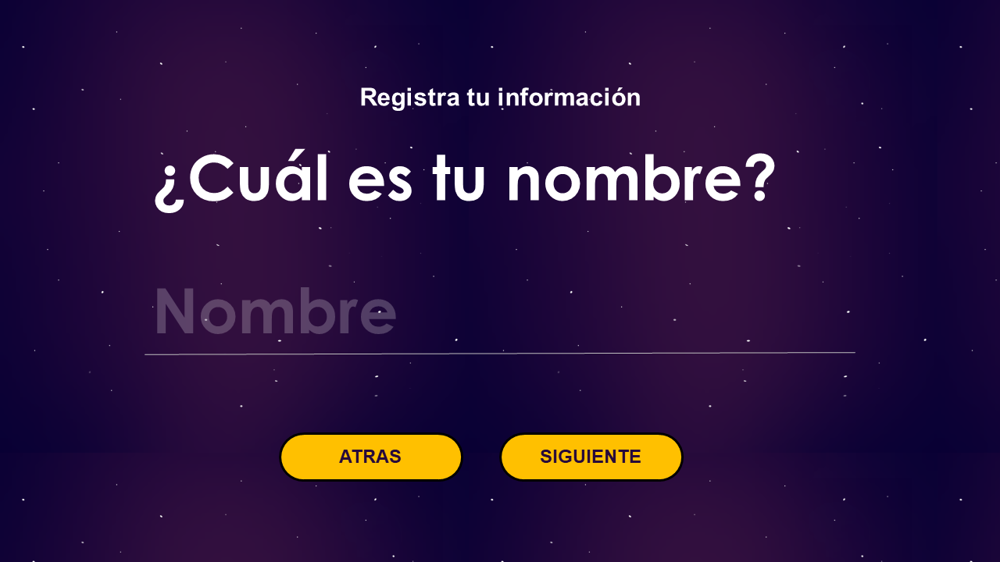
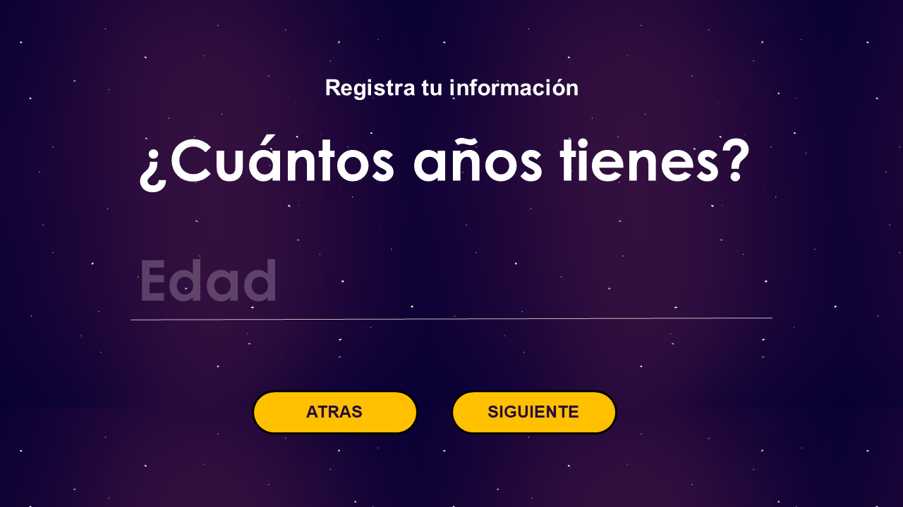
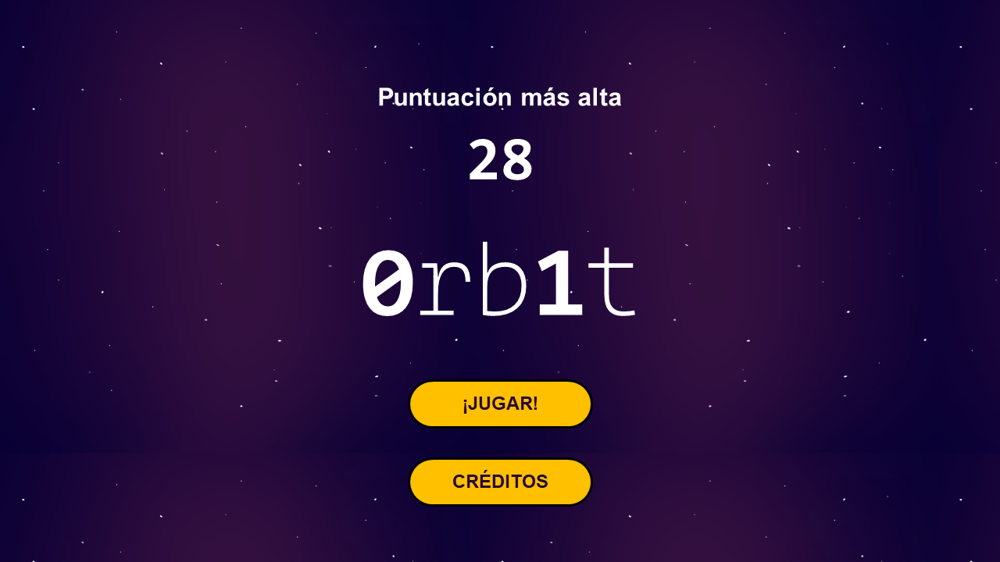
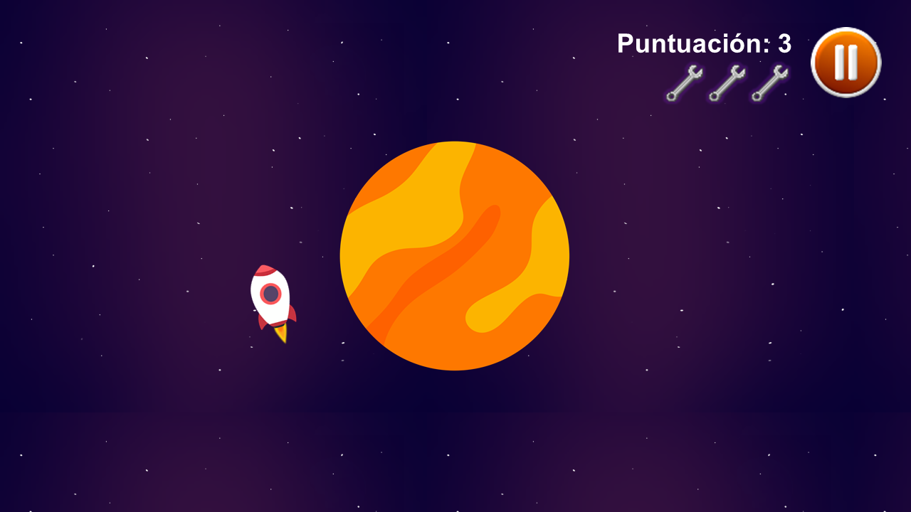
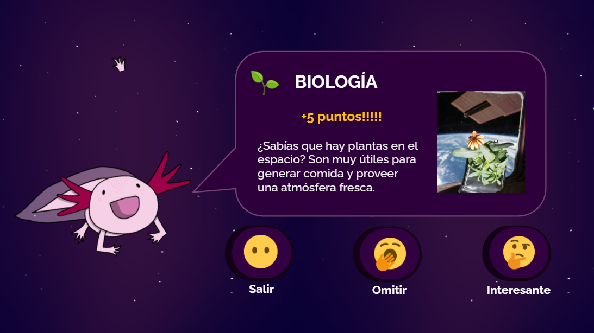
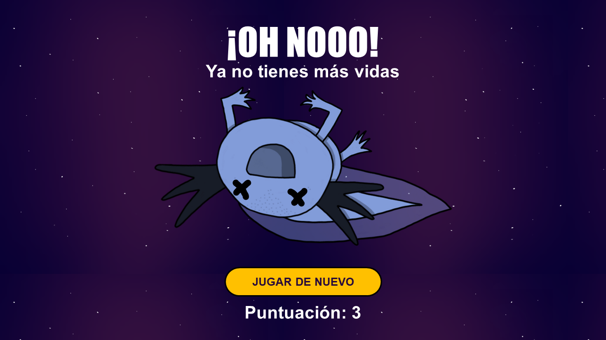

# Especificación de Requerimientos de Software

# Índice
- [Introducción](#introducción)
  * [Propósito](#propósito)
  * [Alcance](#alcance)
  * [Definiciones y Acrónimos](#definiciones-y-acrónimos)
- [Descripción General](#descripción-general)
  * [Roles de usuario](#roles-de-usuario)
  * [Suposiciones y Dependencias](#suposiciones-y-dependencias)
- [Características del Sistema y Requerimientos](#características-del-sistema-y-requerimientos)
  * [Requerimientos Funcionales](#requerimientos-funcionales)
  * [Requerimientos de Interfaz Externa](#requerimientos-de-interfaz-externa)
  * [Requerimientos No Funcionales](#requerimientos-no-funcionales)
- [Pantallas](#pantallas)
  * [Wireframes](#wireframes)
- [Referencias](#referencias)

# Introducción

## Propósito
Desarrollar un videojuego que inspire a las y los jóvenes a estudiar carreras relacionadas con STEM y a desarrollar competencias relacionadas con las mismas. 

## Alcance
- Descripción: Un videojuego de mini-puzzles, donde el usuario deberá poner objetos en la órbita de un planeta. 
- Beneficios: Fomentar el interés en carreras STEAM como oportunidades para impactar positivamente al mundo.
- Meta: Difundir la importancia de las carreras STEM y mostrar ejemplos de lo que se ha logrado gracias a ellas. 
- Objetivos: Que más gente estudie carreras STEM.

_Movimiento STEAM_ busca impulsar la educación y talento STEAM. Para ello, se va a desarrollar un videojuego en donde los usuarios tendrán que enfrentarse al reto de poner objetos en la órbita de un planeta, el cual es un gran ejemplo de lo que profesionistas en áreas STEM han logrado.

## Definiciones y Acrónimos
__STEAM:__ Ciencia, Tecnología, Ingeniería, Arte y Matemáticas (por sus siglas en inglés)

__STEM:__ Ciencia, Tecnología, Ingeniería y Matemáticas (por sus siglas en inglés)

__Movimiento Steam:__ Es una asociación sin fines de lucro que está liderando un movimiento regional que impulsa la Educación y el talento STEAM, los empleos del futuro y la innovación, con visión social e incluyente (Movimiento STEAM, 2020).

# Descripción General
El producto que desarrollamos es un videojuego, el cual se compone de una serie de puzzles, en donde los jugadores deberán lograr que un objeto se quede en la órbita de un planeta. 

## Roles de usuario

- __Jugador__: Niñas y niños de entre 9-12 años y jóvenes de entre 13-19 años de edad, cursando algún nivel de estudios que mediante el juego podrán aprender acerca del impacto de las carreras STEM en el mundo. Necesita un videojuego con dinámicas sencillas y entretenidas, así como una manera de recabar sus intereses personales para realizarle sugerencias acertadas. 

- __Administrador de datos__: Tendrá acceso a todos los datos estadísticos de los jugadores, con el fin de recabar información y tomar decisiones acertadas. Necesita acceso a los datos recopilados de los jugadores, al igual que gráficos que representen dichos datos y estadísticas.

- __Administrador de juego__: Se encargará del funcionamiento adecuado del juego, así como de todos los sistemas de comunicación e información. Necesita datos de estatus de la base de datos, así como de la integridad de la información y los usuarios registrados. 

## Suposiciones y Dependencias
<!-- There might be factors that impact your ability to fulfill the requirements outlined in this document. What are those factors? -->
Algunos factores que puedan impactar nuestra habilidad para cumplir con los requerimientos enumerados en este documento incluyen:
- Tiempo de implementación
- Recursos tecnológicos disponibles
- Mantenimiento de componentes externos

<!-- Are there any assumptions you’re making that could turn out to be false? You should include those here, as well. -->

Para el desarrollo de este proyecto se asume que:
- El usuario tendrá acceso a una computadora con conexión a internet para poder ejecutar el juego
- El usuario no requiere de herramientas externas de accesibilidad como lectores de pantalla
- El usuario cuenta con conocimientos básicos de pensamiento crítico y de física 
- La base de datos será implementada en un servidor funcional y disponible

<!-- Finally, you should note if your project is dependent on any external factors. This might include software components you’re reusing from another project. -->
Igualmente, el proyecto depende de otros factores externos, tales como:
- La implementación en la página web
- Uso de librerías de Unity para su desarrollo
- Estatus de base de datos y servicios web

# Características del Sistema y Requerimientos
<!-- This is where you detail the specific requirements for building your product. -->

## Requerimientos Funcionales
<!-- The functional requirements describe the services and functions of a system. Functional requirements must be precise and unambiguous.

Include user stories, which are short descriptions of a feature, told from the perspective of one of your end user profiles. They are typically structured in the following fashion: -->

<!-- |__Short identifier__|_Como [type of user], requiero [some goal] para [some reason]_|_Must have_|_Write here any additional consideration_| -->
|Título|Historia de usuario|Importancia|Notas|
|---|---|---|---|
|__Generar niveles__|_Como **jugador**, requiero obstáculos para divertirme mientras hago uso del software_|_Prioridad: 1_| Se generarán niveles con obstáculos y dinámicas cambiantes, como: variación de la masa y distancia de los objetos, cantidad de revoluciones orbitales requeridas, cantidad de planetas, entre otros. |
|__Elementos interactivos__|_Como **jugador**, requiero elementos gráficos visualmente atractivos y controles que me permitan interactuar con los elementos_|_Prioridad: 1_| Las formas de interacción con los controles del juego deberán ser intuitivas y fáciles de usar |
|__Dinámica del juego__|_Como **jugador**, requiero que los objetos interactivos (naves y planetas) se comporten de manera predecible y realista_| _Prioridad: 2_ | Tener una dinámica físicamente realista es importante para cumplir con los objetivos de pensamiento crítico en este proyecto |
|__Puntuación__|_Como **jugador** requiero tener registro de mi puntuación en diferentes niveles_|_Prioridad: 2_| Deberá definirse la puntuación otorgada para cada nivel |
|__Tutorial__|_Como **jugador**, requiero una serie de instrucciones para saber cómo utilizar el software_|_Prioridad: 2_| Integrar tutorial al primer nivel |
|__Recopilación de datos__|_Como **administrador de datos**, requiero que el software recopile datos para poder acceder a ellos de una manera clara y concisa_|_Prioridad: 2_| La visualización de datos puede ser por medio de un dashboard |
|__Información STEM__|_Como **jugador**, requiero aprender sobre las posibilidades de las carreras STEM para poder tomar una decisión vocacional informada_|_Prioridad: 3_|
|__Progreso del juego__|_Como **jugador**, requiero conocer el progreso que llevo en el juego (vidas, puntuación, nivel) para tener una experiencia más gratificante usando el software_|_Prioridad: 3_|
|__Estatus del juego__|_Como **administrador de juego**, requiero que el software tenga forma de indicar su estatus (activo, con fallas, etc) con el fin de dar mantenimiento_|_Prioridad: 3_|

## Requerimientos de Interfaz Externa
<!-- External interface requirements are types of functional requirements. They outline how your product will interface with other components or systems. -->
De los requerimientos anteriormente enumerados, puede identificarse que será necesaria la comunicación con otros componentes de software:
- **BASE DE DATOS:** El software deberá ser capaz de establecer una conexión a un servidor MySQL para el almacenamiento de datos sobre usuarios, progreso, información estadística, etc. 
- **SITIO WEB PARA DISTRIBUCIÓN:** El software deberá poder comunicarse con los servidores del cliente con el fin de incrustar el juego en una página web que pueda ser accesada por los usuarios.
- **MOTOR DE FÍSICA DE UNITY:** El software deberá tener compatibilidad con el motor de física de Unity para poder realizar las interacciones entre los diferentes elementos. 
- **ACCESO A LA INFORMACIÓN:** El software deberá proveer métodos para acceder fácilmente a la información recabada con el fin de que el cliente pueda tomar decisiones acertadas.

## Requerimientos No Funcionales
<!-- Non-functional requirements are restrictions on the system or the development process. Non-functional requirements can be more critical than functional ones. If they are not met, the system is useless! -->
- Aviso de privacidad
- Clasificación E (contenido apto para todas las edades)
- Todos los componentes deben tener un estilo artístico unificado
- La partida promedio por usuario no debe exceder los 10 minutos
- Ejecución en sistemas con bajos recursos como laptops o tabletas mediante un navegador
- Entregar software terminado a finales de abril
- Usar una metodología SCRUM
- Se respectará la propiedad intelectual de todo en este mundo :D

# Pantallas
<!-- Identifying the individual screens (for an app), or pages (for a website) are where a product’s shape starts to become clear. They are a distillation of the user stories into a set of distinct sections that satisfy the needs and behaviors identified so far. The process of outlining an application’s screens may also highlight any requirements or considerations that have been overlooked up to this point.

This has the dual purpose of both contributing to a more accurate vision of the product early on, and serving as a jumping-off point for the time when designers do get involved. -->

Se incluirán diversas pantallas para el proyecto, como:
- Juego
  - Registro: Ingresar alias, escolaridad, estado y género :octocat: .
  - Menú principal: Muestra puntuación más alta y botones para jugar y ver créditos
  - Nivel: Elementos interactivos e indicador de puntaje y vidas.
  - Información: Mostrará información relevante sobre las carreras STEM. El jugador podra calificar la información o abandonar el juego.
  - Final: Enseñar información de la sesión al terminar el juego.
  - Créditos: Muestra los nombres del equipo, así como la propiedad intelectual de los recursos utilizados. 
- Dashboard:
  - Pantalla de inicio de sesión: Se solicitará al administrador de datos ingresar su usuario y contraseña
  - Visualización de datos: Mostrará datos estadísticos y demográficos de los usuarios utilizando gráficas. Hasta ahora se proponen las siguientes:
    - Estado/región y cuál tiene más interés en cierta área
    - Puntuación más alta por edades
    - Área de STEM con más interés
    - Minutos totales jugados
    - Nivel de escolaridad e interés en área de STEM
    - Distribución de edades con respecto a género
    - Distribución de nivel de escolaridad de cada género
    - Nivel de escolaridad por estado
    - Cantidad de jugadores de cada género contra el total de cada estado

## Wireframes
Wireframes are simple page layouts that outline the size and placement of elements, and features on a page. They are generally devoid of color, font styles, logos or any design elements.

Wireframing is probably the most time-consuming step of this process and for some simple projects, it may be overkill. For complex projects where serious design thinking needs to happen, wireframes are an indispensable tool.

Here are some popular tools for wireframing:
- https://marvelapp.com/  
- https://balsamiq.com/ 
- https://jetstrap.com/ 
- https://www.fluidui.com/ 
- https://ninjamock.com/ 
- https://www.justinmind.com/ 
- https://moqups.com/

# Referencias
Movimiento STEAM. (2020). _¿Qué es movimiento STEAM?_ https://movimientosteam.org/